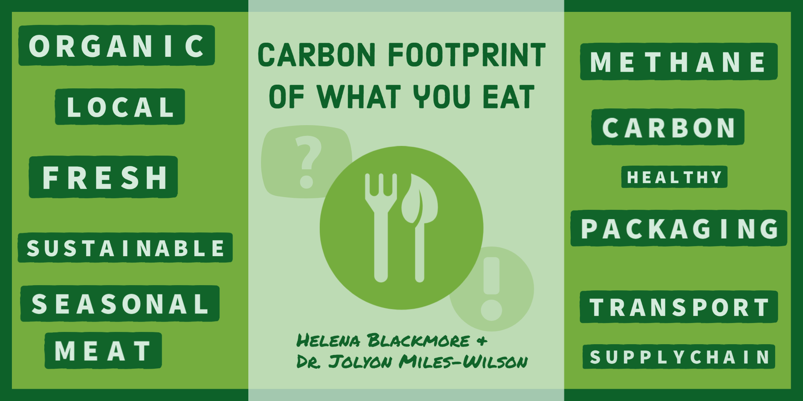

<head>
<!-- Google tag (gtag.js) -->

</head>
<link rel="stylesheet" href="style.css">

A 90 minute workshop focusing on the role of food in climate change and the actions that we as consumers can take to reduce our impact. The workshop will be interactive and will include polls, mini-games, group discussion, examination of a sample weekly food shop and thinking about short and long-term goals to reduce individual impact. The aim of the workshop is to demystify the role of food systems in climate change and to inform and empower consumers with knowledge necessary to make informed decisions when shopping for food.

# References

 

### Resources
- <a class="link-foss" href="https://presenter.ahaslides.com/share/carbon-footprint-of-what-you-eat-1633969225439-5llkplf051"> Workshop slides </a>
- <a class="link-foss" href="images/CF_quiz.html"> Food carbon footprint visualisation: guesses vs actual values </a>
- <a class="link-foss" href="https://carbon-recpt.herokuapp.com/"> Carbon receipts app </a>
- 
 Other resources:

    - <a class="link-foss" href="https://www.drawdown.org/climate-solutions-101/">
      project drawdown: climate solutions 101 </a>
    - <a class="link-foss" href="https://ourworldindata.org/environmental-impacts-of-food">
      Our world in data: environmental impact of food </a>
    - <a class="link-foss" href = "https://www.epa.gov/ghgemissions/global-greenhouse-gas-emissions-data">
    global greenhouse gas emissions </a>
    - <a class="link-foss" href=" https://www.bbcgoodfood.com/seasonal-calendar">Seasonal produce </a>
    - <a class="link-foss" href="https://www.bbcgoodfood.com/recipes/collection/autumn-recipes"> Seasonal recipes </a>
    - <a class="link-foss" href=" https://petition.parliament.uk/petitions/600253/sponsors/new?token=WRejkKz_9fK8UxIXz6pT"> Carbon labelling: petition </a>
    - <a class="link-foss" href="https://figshare.com/articles/dataset/SU-EATABLE_LIFE_a_comprehensive_database_of_carbon_and_water_footprints_of_food_commodities/13271111 "> A comprehensive database of carbon and water footprints of food commodities  </a>

    
   

  
  

  

  

