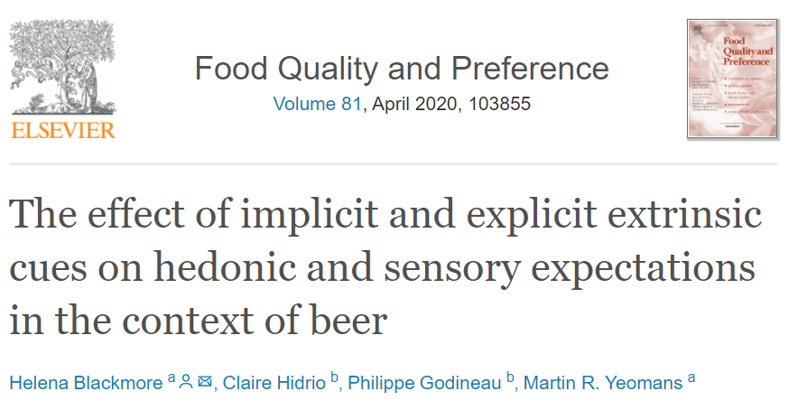
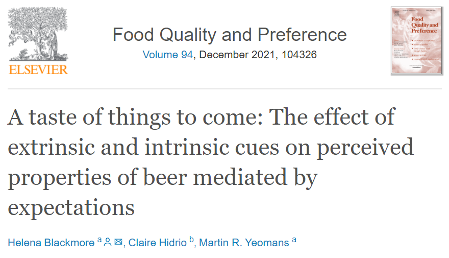

<a href=https://doi.org/10.1016/j.foodqual.2019.103855 target="_blank"></a>

<a href=https://doi.org/10.1016/j.foodqual.2021.104326 target="_blank"></a>


```{css, echo = FALSE}
img {
  width: 30%;
  margin: 30px
}

```